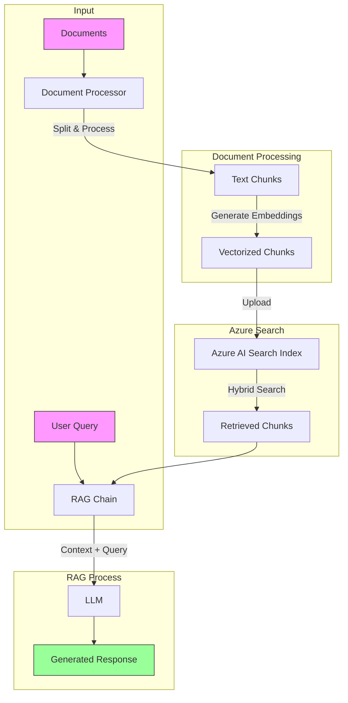

# RAG System with Azure AI Search

This is a Retrieval-Augmented Generation (RAG) system that uses Azure AI Search for efficient document retrieval and OpenAI's GPT models for generating responses. The system is designed to process documents, create searchable indexes, and provide accurate answers to questions based on the document content.

## Architecture



The system consists of four main components:

1. **Document Processor** (`document_processor.py`)
   - Handles document loading from various file formats (currently focused on Markdown)
   - Splits documents into manageable chunks
   - Processes and enriches documents with metadata
   - Uses RecursiveCharacterTextSplitter for optimal text chunking

2. **Azure Search Manager** (`azure_search_manager.py`)
   - Manages the Azure AI Search index
   - Creates and updates search indexes with vector search capabilities
   - Handles document uploads with embeddings
   - Implements hybrid search functionality with category filtering
   - Uses Azure OpenAI embeddings for vector search

3. **RAG Chain** (`rag_chain.py`)
   - Implements the main RAG logic
   - Combines search results with LLM generation
   - Uses a carefully crafted prompt template for consistent responses
   - Supports multiple LLM options (Azure OpenAI, OpenAI, Anthropic)

4. **Main Application** (`main.py`)
   - Provides the entry point and CLI interface
   - Handles knowledge base setup
   - Implements interactive chat functionality
   - Supports batch question answering

## Setup

1. Configure environment variables in `.env`:
   ```
   AZURE_SEARCH_ENDPOINT=your_search_endpoint
   AZURE_SEARCH_KEY=your_search_key
   AZURE_SEARCH_INDEX_NAME=your_index_name
   AZURE_OPENAI_ENDPOINT=your_openai_endpoint
   AZURE_OPENAI_API_VERSION=your_api_version
   AZURE_OPENAI_KEY=your_openai_key
   OPENAI_API_KEY=your_openai_key
   ```

2. Install dependencies:
   ```bash
   pip install langchain langchain-openai langchain-community azure-search-documents
   ```

## Usage

### Setting up the Knowledge Base

To process documents and create the search index:

```bash
python main.py --setup path/to/documents
```

This will:
- Load documents from the specified directory
- Process them into chunks
- Create or update the Azure Search index
- Upload the documents with embeddings

### Interactive Chat

To start an interactive chat session:

```bash
python main.py
```

This launches a chat interface where you can ask questions about the indexed documents.

### Batch Question Answering

To process a list of questions from a file:

```bash
poetry run python main.py (--questions)
```

This reads questions from `questions.txt` and writes answers with sources to `answers_with_sources.txt`.

## Features

- **Hybrid Search**: Combines vector similarity search with traditional keyword search for better results
- **Category Classification**: Automatically classifies questions into categories (ΚΑΡΤΕΣ, ΚΑΤΑΝΑΛΩΤΙΚΑ, ΣΤΕΓΑΣΤΙΚΑ)
- **Source Attribution**: Provides source documents and relevance scores for transparency
- **Configurable Chunking**: Adjustable chunk size and overlap for optimal document processing
- **Comprehensive Logging**: Detailed logging of operations and errors
- **Flexible LLM Support**: Can use different language models (Azure OpenAI, OpenAI, Anthropic)

## Configuration

Key configuration parameters in `config.py`:
- Chunk size and overlap for document processing
- Azure Search and OpenAI endpoints and credentials
- Logging configuration
- Index name and other Azure Search settings

## Error Handling

The system includes comprehensive error handling:
- Document processing errors
- Search index creation/update errors
- API communication errors
- LLM generation errors

All errors are logged for debugging and monitoring.

## Logging

Logs are written to `logs/azure_search.log` with configurable log levels and formats. Both file and console logging are supported.

## Best Practices

1. **Document Processing**
   - Use consistent document formats
   - Ensure documents are properly formatted
   - Consider chunk size based on content type

2. **Search Configuration**
   - Adjust vector search parameters for your use case
   - Configure scoring profiles if needed
   - Monitor and optimize index performance

3. **Response Generation**
   - Fine-tune the prompt template for your use case
   - Adjust temperature and other LLM parameters
   - Monitor token usage and costs

## Limitations

- Currently optimized for Markdown files
- Requires Azure AI Search and OpenAI API access
- Vector search dimensions fixed at 1536 (OpenAI embedding size)
- Category classification limited to four predefined categories

## Takeways
- Sometimes it has limitations to combine information from different sources
- It is important to have a good chunking strategy to improve search results
- Hybrid search can be a powerful tool to combine different search strategies, but also misleading if not properly configured


## Performance Improvements
- Retrieve documents from two indexes and combined them
- Use Azure Cognitive Search for document processing to extract keywords -> append metadata -> enhance search results
- Agentic chunking for better search results